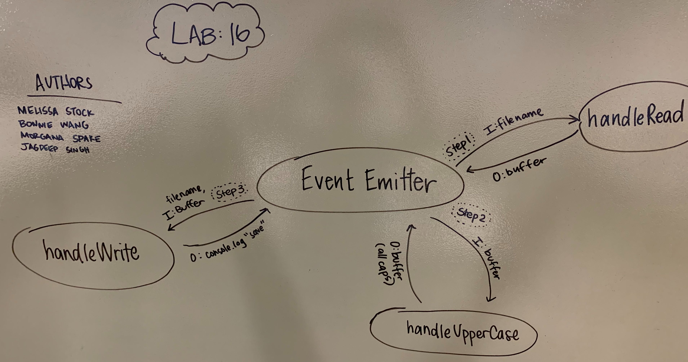

#  LAB

## lab-16-event-driven-app

### Author: Bonnie Wang

### Links and Resources

- [submission PR](http://xyz.com)
- [travis](http://xyz.com)
- [back-end](http://xyz.com) (when applicable)

#### Documentation

- [api docs](http://xyz.com) (API servers)
- [jsdoc](http://xyz.com) (Server assignments)
- [styleguide](http://xyz.com) (React assignments)

### Modules

#### `read.js -> buffer`

#### `uppercase.js -> uppercase string`

#### `write.js`

#### `logger.js`

#### `error.js`

#### Running the app

- `node app.js test.txt`
  - Modifies file and with uppercase text.

#### Tests

- npm test

#### UML

